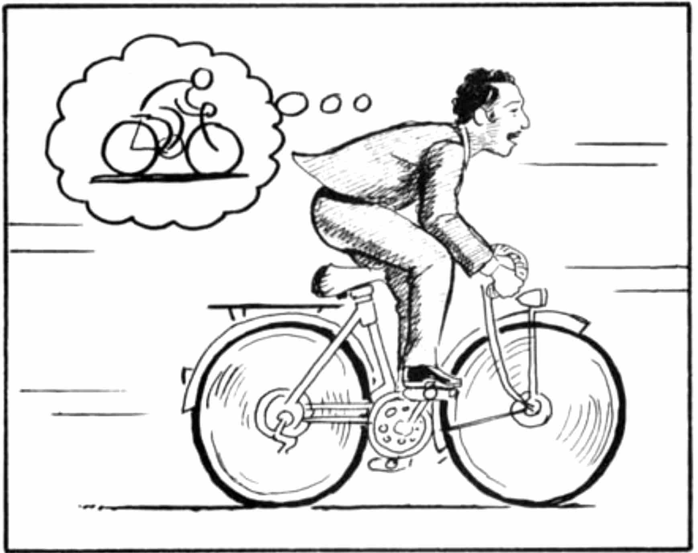

<h1 align="center">
  <br>
  <a href="https://github.com/VinBots/world_models"></a>
</h1>

<h4 align="center">A world model built by 3 components :  vision, memory and controller </h4>
<p align="center">
  <a href="#about">About</a> •
  <a href="#learning">Learning</a> •
  <a href="#installation">Installation</a> •
  <a href="#configuration">Configuration</a> •
  <a href="#references">References</a> •
  <a href="#credits">Credits</a> •
  <a href="#going-further">Going Further</a>
</p>

---

<h1 align="center">
  <br>
  <a href="https://github.com/VinBots/world_models"></a>
</h1>
<h5 align="center">A World Model, from Scott McCloud’s Understanding Comics.</h2>

## About

Evidence suggest our perception is governed by our brain's prediction of the future based on our internal model. Can we build models of the world? Can we train and learn in our imagined world?

This repository is the reproduction of the paper, Ha and Schmidhuber, "Recurrent World Models Facilitate Policy Evolution", 2018.

## Learning
* Variational Auto-Encoder (VAE)
* LSTM (Long-Short Term Memory) Network with Mixture Density Network (MDN)
* Covariance- Matrix Adaptation Evolution Strategy (CMA-ES)
* Use of pytest for test-driven developement
* Use of dataclasses for configuration parameters

## Installation

**1. Clone the repository**

```
git clone https://github.com/VinBots/world_models.git
```

**2. Create and activate a new virtual environment via conda**

```
conda create --name new_env python=3.6.13
conda activate new_env
```

**3. Install the required packages**

Go to the root directory and install the dependencies
```
cd world_models
pip install -r requirements.txt
```
**4. Run the algorithm**
```
python src/main.py
```

## Configuration

All the parameters are located in `src/config.py`

## References

* Ha and Schmidhuber, "Recurrent World Models Facilitate Policy Evolution", 2018 (https://worldmodels.github.io/)
* [presentation by the author](https://www.youtube.com/watch?v=HzA8LRqhujk) 


## Credits

* TBC [work in progress]


## Going Further

* TBC [work in progress]